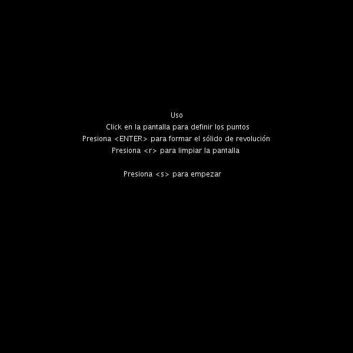

# CIU_P2

## Autor
Francisco Jose Santana Sosa

## Descripción
En esta práctica se ha implementado una utilidad que permite generar sólidos de revolución, para ello primero se permite al usuario definir
un perfil en la zona derecha mediante clics del ratón, luego a partir de esos vértices se define una malla con los vértices rotados, a partir de esa malla se 
generan los triángulos para formar el sólido de revolución.

## Referencias
Guión de prácticas

## Muestra de ejecución

